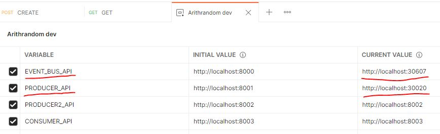
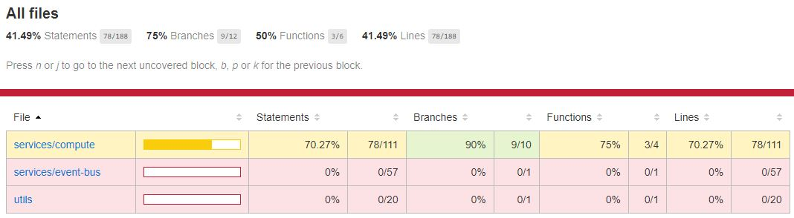

<h1 align="center">🎲 Arithrandom</h1>

<p align="center">A producer/consumer system, made from the scratch</p>

___

Table of contents
=================
<!--ts-->
   * [About](#About)
   * [Architecture](#architecture)
   * [Information flow](#information-flow)
   * [Features](#features)
   * [How to run the project](#how-to-run-the-project)
      * [Skaffold](#skaffold)
      * [Kubectl](#kubectl)
      * [Docker compose](#docker-compose)
      * [Traditional way](#traditional-way)
   * [Roadmap](#roadmap-)
   * [Tests](#tests)
   * [Author](#author)
<!--te-->

____

## About

The project aims to show a simple Producer/Consumer system where the producer generates random arithmetic expressions and sends them to the consumer. So far, only sum expressions are generated, but the consumer is already prepared to receive other operations.

In addition, no pre-existing message broker on the market was used. After researching, I decided to create an EventBus that centralizes message exchange between microservices. The operation is simple: the microservices send messages to EventBus, and it sends them to the microservices.

This communication could be done by socket.io or gRPC, but the simplest way was chosen to demonstrate the communication, with HTTP requests through the [axios](https://github.com/axios/axios). At the same time, to facilitate the development of the application, [feathersjs](https://feathersjs.com/) was adopted combined with [Express.js](http://expressjs.com/).


## Architecture

The project has been separated into a few folders, where each folder is a separate project.

```
|_ client # frontend (React)
|_ consumer # backend (featherjs + typescript)
|_ event-bus # backend (expressjs + typescript)
|_ infra # devops (kubernetes)
|_ producer # backend (featherjs + typescript)
```

*Ps.: The `producer` was made with the [Repository Pattern](https://martinfowler.com/eaaCatalog/repository.html) in mind, having an extra layer to separate the responsibilities*

## Information flow

The flow starts with an HTTP call to the producer on the POST `/expressions` route, which triggers the creation of the random expression and sending it to the EventBus. In turn, EventBus generates a unique key (eventId - [uuidv4](https://github.com/uuidjs/uuid)), sends the message to all subscribers (in principle, all microservices are subscribed), and returns the key to the producer.


After the consumer receives the message, the equation is solved and a message is sent to the EventBus with the result. As in the first part, the EventBus fires for everyone subscribed. In this case, the producer becomes a consumer and updates the result in its database.


*Ps.: At first, the data was stored in memory, but in a future implementation, it is easy to adopt some database. As EventBus receives a lot of data and it can change according to the topic of the message, I believe it would be better to use a non-relational database such as MongoDB. Producer, on the other hand, has a better-defined structure, so it could use a relational database, such as Postgres or MySQL.*

## Features
* [x] The Producer generating random addition expressions of two positive integers, e.g. "2+3="
* [x] The Consumer computing and sending an event with the correct mathematical result for each expression it receives
* [x] The consumer is ready to support more than simple addition (see: [compute-expression.ts](./consumer/src/services/compute/compute-expression.ts))
* [x] If the consumer goes down, when it goes up again it will solve the pending equations
* [x] Every service has [winston](https://github.com/winstonjs/winston) configured to log the messages
* [x] Unit tests in the core of the project (generation and computing of the expressions) with [Jest](https://jestjs.io/)
* [x] The Producer and Consumer as separate services
* [x] An event bus to handle the events between the services
* [x] Docker configuration
* [x] Kubernetes configuration (`infra/k8s` folder)
* [x] [Skaffold](https://skaffold.dev) configuration

## How to run the project

The first step is to set the environment variables. To do this, duplicate the `.env.example` files to `.env`, changing the variables as you wish.

After this step, there are some ways to run the entire application:

### Skaffold

The easiest way to run the project is to have [Skaffold](https://skaffold.dev/docs/install/) installed and running the following command in the main project folder:

```bash
skaffold dev
```

And then, to know the server port use the command:

```bash
kubectl get services
```




*Ps.: you can import the endpoints from the file `postman_collection.json`*

### Kubectl

The other way is to have [kubectl (Kubernetes)](https://kubernetes.io/docs/tasks/tools/) installed and run:

```bash
cd producers/
docker build -t wenderpmachado/producers .

cd ../event-bus
docker build -t wenderpmachado/event-bus .

cd ../consumer
docker build -t wenderpmachado/consumers .

cd ..
kubectl apply -f infra/k8s/
```

### Docker compose

If you are familiar with docker compose, each project has a file where you can run:

```bash
docker-compose -f "docker-compose.yml" up -d --build
```

### Traditional way

Finally, if you intend to run all microservices on your terminal, each folder has a `package.json` that has the initialization command:

```bash
npm run dev
# or
yarn dev
```

## Tests

To run the tests, the following functions were created in `package.json`:

```bash
yarn test # run all unit tests
test:watch # every change made to the code, runs the tests again
test:cov # generate coverage report ('/coverage')
test:clear # remove cache and the coverage from tests
```


*Ps.: After running the coverage test, try to open `/coverage/lcov-report/index.html` in your browser*




## Roadmap 🔭

* [ ] Producer generates other random expressions
* [ ] Producer accept expression from frontend
* [ ] Finish implementing MongoDB in the `event-bus` microservice
* [ ] Finish implementing Postgres in the `producer` microservice
* [ ] Increase the unit test coverage
* [ ] Add CI/CD with GitHub Actions
* [ ] Add ESlint
* [ ] Add EventBus endpoint to Consumers subscribe / unsubscribe
* [ ] Add load testing
___

## Author

Made by [Wender Machado](https://www.linkedin.com/in/wenderpmachado/) 🚀
